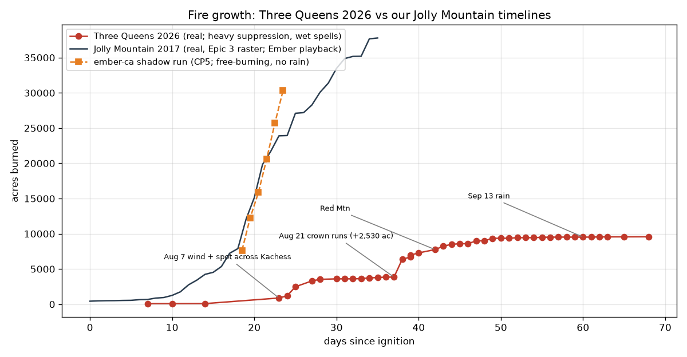

# Three Queens Fire 2026 — progression and behaviour timeline, vs our timelines

Built 2026-09-30 night from the incident's own information products: 42 InciWeb daily updates
(text, `store/reference/inciweb-3q/updates/`), the Facebook page's daily update sheets and fire
maps (`store/reference/facebook-3q/`, tag `incident-report`), and the field photos. Numbers are
the incident's (IR-flight acreage where stated). Data: `three_queens_2026_growth.csv`;
chart: `three_queens_2026_growth.png`.

Early acreage from the July maps: 79 ac (Jul 22), 80 (Jul 25), 88 (Jul 29, still the latest IR
on the Aug 6 map), then 883 (Aug 7), 1,200 (Aug 8), 2,478 (Aug 9), 3,305 (Aug 11), 3,533 (Aug 12).

## The fire in five phases

| phase | dates (day) | acres | what the fire did | weather / suppression |
|---|---|---|---|---|
| 1. Holdover | Jul 15 – Aug 6 (0–22) | 79 → 88 | Lightning start high on Three Queens peak; a small plume at the peak for three weeks, burning in subalpine fir and rock (photos: single column off the summit). | Monitoring; Type 3. |
| 2. Wind runs | Aug 7 – Aug 12 (23–28) | 883 → 1,200 → 3,533 | High winds two days running; **spot fire established across Lake Kachess** (east side, north end). "Wind-driven fire behaviour... subalpine fir stringers... extreme slopes, unstable terrain and **rolling material**." Runs SE to No Name Ridge, along the east side of Kachess toward Thorp Creek. | Level 3 evacuations (Cooper Lake); Type 2 team Aug 10; heavy helicopters + scoopers (54,000 gal one ship one day); Thorp Mtn repeater **wrapped**; Cooper Lake **sprinklers**. |
| 3. Wet lull | Aug 13 – Aug 20 (29–36) | 3,533 → 3,848 | Thunderstorms, **wetting rain Aug 14**. North flank creeps to Chikamin Ridge / Cooper Pass with **spotting in aligned drainages**; south flank **backs slowly downhill into Thorp Creek**; fire crosses Mineral Creek "at a slow rate", "primarily burning in timber where heavier fuels are drier". | Line everywhere: Kachess Ridge handline, FSR 4308 dozer line, **tethered dozers on steep slopes**, masticators, shaded fuel breaks, **boats ferrying hotshots**, mobile retardant base, IR drone. |
| 4. Blow-up and Red Mountain | Aug 21 – Aug 27 (37–43) | 3,849 → **6,379** → 7,758 → 8,240 | **Aug 21**: hot (>85 °F), unstable, poor RH recovery: "fuels, topography and weather aligned to produce rapid rates of spread. **Sustained torching and intermittent crown runs**, generating spotting... pushed north towards Cooper Lake **under strengthened night-time winds**" — **+2,530 acres in a day**. Pyrocumulus over the ridges (photos). Then east across **Red Mountain** (Aug 25): "ongoing torching, uphill runs and intermittent spotting". King (Aug 19) and Goat (Aug 22–23) fires start nearby. | Red Flag Warning; UAS dropping ignition spheres for **firing operations** along the SW flank into the lake shore; Skycranes with retardant; containment *fell* 13 % → 5 %. |
| 5. Long tail | Aug 28 – Sep 28 (44–75) | 8,496 → 9,572 | Cool/wet spells (Aug 29–30, Sep 2–4, **Sep 13 heavy rain**) with warm dry gaps. "**Heavy dead fuels carry the fire with occasional transitions to tree crowns aided by lichen**"; Sep 2 observation: "**mostly shin-height flame lengths and occasional single-tree torching producing isolated 200–300 ft spot fires**" (+337 ac NE). Interior pockets keep burning; Sep 28: "still hot spots with **creeping and smoldering fire** that become more active during dryer, windier periods." | Burnouts toward Cooper Lake; contingency lines Kachess↔Cle Elum↔Keechelus (powerline corridors, shaded fuel breaks); chipping/hauling; repair; Type 3 Sep 21; district Sep 28. |

Behaviour vocabulary straight from the incident (useful for class names / HUD text): backing,
creeping, smouldering, single-tree torching, group torching, sustained torching, intermittent
crown run, uphill run, spotting (in drainages; across the lake; 200–300 ft isolated), rolling
material, interior pockets, night-time push.

## Compared with our timelines

What we have: **Jolly Mountain 2017** as observed (Epic 3 raster, the CP2 playback the renderer
uses in `S_jolly_hcp4`), the **ember-ca** CP5 shadow run over Jolly's Labor Day days, and the
**synthetic 48 h fire** over Three Queens (`S_tq_fire_synth`, renderer fixture only). We have
**no Three Queens 2026 simulation or replay** — the comparison is fire-to-fire, same mountains.

| | Three Queens 2026 (real) | Jolly Mountain 2017 (real, our playback) | ember-ca (CP5) | what our renderer shows |
|---|---|---|---|---|
| final size | 9,572 ac (3,874 ha) in ~68 days | 37,784 ac (15,291 ha) in 36 days | 3,091 → 12,280 ha in 5 days (1.5× Jolly's observed) | — |
| biggest day | +2,530 ac (Aug 21, crown runs at night) | ~+4,700 ac (day 21, Sep 1 2017) | ~+5,100 ac (sim day Sep 1–2) | head/flank/backing classes; head brightest |
| shape of the curve | **steps**: 3 weeks smouldering, two wind days, a week flat, one blow-up day, then a long tail | smooth S-curve with Labor Day surge | steep, monotonic | fire clock plays whatever the stream says |
| what stops growth | **rain** (5 wet spells) and **line** (suppression shaped every flank) | line + weather | nothing — no precipitation in the HRRR window, no suppression | no rain, no suppression shown |
| spotting | across Lake Kachess (~0.5–1 km) on wind days; 60–90 m isolated spots on quiet days; spotting in aligned drainages | (not in the perimeter raster) | 42–331 m (309 brands, 22 ignitions) | ember streaks + spot flares (H4-4) |
| flame / crown | mostly surface: shin-height flames; single-tree → group → sustained torching; crown runs on the worst day; lichen as ladder | — | crowning on (classes) | flame cards 0.4–22 m by class; torch tongues in crowns |
| smoke | pyrocumulus columns; morning inversions filling valleys; smoke heavy enough to **ground aircraft** and blind initial attack on Goat | — | — | Brad: "waaay too thin"; smoke volume deferred to reference |
| night | the biggest run was at night; glowing slopes, torching under stars (3 photos) | — | — | no night look yet |
| after the front | creeping, smouldering, interior pockets for **weeks**; logs and stumps burning inside | — | burned set goes cold | char + mosaic; smoulder/ash deferred |
| suppression on the land | dozer and hand lines, shaded fuel breaks, tethered dozers on slopes, hose lays and sprinkler lines, wrapped lookout/repeater/guard station, burnouts, retardant lines, chipped slash | — | (CP6 brought line/retardant to the sim) | **none drawn** |

### What this says about parity (for the plan)

1. **The look of one day is not the problem; the story of the fire is.** Three Queens is a
   stepped fire: long smoulder, short violent runs, long tail — driven by rain and line. Our
   Jolly timeline is a smooth surge and our model has no rain and draws no suppression. A pitch
   demo of *this* fire needs precipitation in the weather input and suppression drawn on the
   landscape (lines, burnouts, retardant, sprinklers, wraps) — not just better flames.
2. **Quiet-day behaviour is most of the fire's life**: backing, creeping, smouldering, interior
   pockets, single-tree torching, 200–300 ft spots. Our flame classes skew to the running head;
   the low classes (backing / creeping / smouldering) need their own look (smoulder smoke + glow,
   ash, single torching trees) — this is the deferred smoulder item, now with reference.
3. **The blow-up day is the money shot** (Aug 21): night-time crown runs, sustained torching,
   pyrocumulus. Needs night lighting (fire as the light source), crown-fire flames above the
   canopy, and smoke volume with a column — the three deferred items, with ~40 photos of exactly
   this (night ×4, smoke columns ×23, aerial ×18).
4. **Spotting across water** (the Aug 7 spot across Kachess) is a signature event of this fire;
   our spot distances (≤331 m) would never cross the lake.
5. **Calibration targets we now have**: daily acreage and containment (CSV), daily perimeter maps
   (Aug 6 – Sep 21), an IR heat map, a hotspot map, a 3D perimeter-over-terrain view, smoke
   outlooks, two hero aerials up Lake Kachess with columns on both shores.

## Where the reference lives

All images: `C:\Projects\Terrain\store\reference\` (outside git; manifest
`viz/reference/manifest.jsonl`). Contact sheets (open in a browser):

| sheet | contents |
|---|---|
| `action.html` | active fire, torching, burnout, night, smoke columns / pyrocumulus / pall, aerials, burn mosaic, heroes |
| `suppression.html` | line building, dozer/excavator, fuel breaks, hose, sprinklers, pumps, wrapped structures, WUI, tactics explainers |
| `reports.html` | daily maps, updates, smoke outlooks, closures, evacuation notices, IR / hotspot maps |
| `stands.html` | stands, density, understory, ground, litter, down logs (Kachess album + incident photos) |
| `sheet.html` | everything (282 images) |

Daily update texts: `store/reference/inciweb-3q/updates/2026-MM-DD.txt` (Aug 8 – Sep 28).
